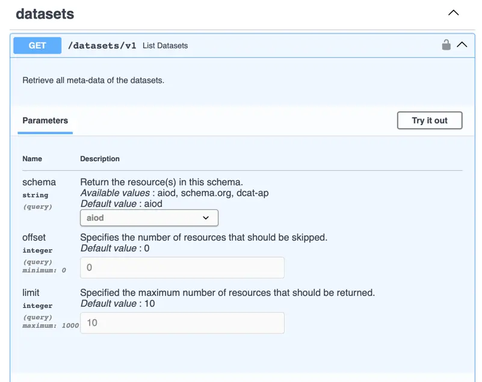

# Using the REST API

The REST API allows you to retrieve, update, or remove asset metadata in the metadata catalogue. 
The assets are indexed from many different platforms, such as educational resources from [AIDA](https://www.i-aida.org),
datasets from [HuggingFace](https://huggingface.co), models from [OpenML](https://openml.org), and many more.

The REST API is available at [`https://api.aiod.eu`](https://api.aiod.eu) and documentation on endpoints 
is available on complementary [Swagger](https://api.aiod.eu/docs) and [ReDoc](https://api.aiod.eu/redoc) pages.

To use the REST API, simply make HTTP requests to the different endpoints.
Generally, these are `GET` requests when retrieving data, `PUT` requests when modifying data, `POST` requests when adding data, and `DEL` requests when deleting data.
Here are some examples on how to list datasets in different environments:

=== "Python (requests)"

    This example uses the [`requests`](https://requests.readthedocs.io/en/latest/) library to list datasets.

    ``` python
    import requests
    response = requests.get("https://api.aiod.eu/datasets/v1?schema=aiod&offset=0&limit=10")
    print(response.json())
    ```

=== "CLI (curl)"

    This example uses [curl](https://curl.se/) to retrieve data from the command line.

    ``` commandline 
    curl -X 'GET' \
    'https://api.aiod.eu/datasets/v1?schema=aiod&offset=0&limit=10' \
    -H 'accept: application/json'
    ```

Additionally, we also provide an [`aiondemand` package](https://aiondemand.github.io/aiondemand/) for Python 
to simplify access to the REST API. You can see an example of that below, and we refer to their dedicated 
documentation pages for full installation and usage instructions.

```python
import aiod
aiod.datasets.get_list()
```


## Exploring REST API Endpoints
By navigating to the [Swagger documentation](https://api.aiod.eu/docs), you can find information and examples on how to access the different endpoints.

### Retrieving Information
For example, if we navigate to the [`GET /datasets/v1`](https://api.aiod.eu/docs#/datasets/List_datasets_datasets_v1_get) 
endpoint and expand the documentation by clicking on the down chevron (`v`), we can see the different query parameters 
and can execute a call directly on the API:



Click the `Try it out` button to be able to modify the parameter values and then click the `execute` button to make the request directly from the documentation page.
Under `response` you will also see an example on how to make the request through the command line using `curl`, e.g.:

```bash
curl -X 'GET' \
  'https://api.aiod.eu/datasets/v1?schema=aiod&offset=0&limit=10' \
  -H 'accept: application/json'
```

Below the example, you will find a section `Server Response` which displays the actual response from the service (if you clicked `execute`).
Normally, this should look similar to the image below; a [HTTP Status Code](https://developer.mozilla.org/en-US/docs/Web/HTTP/Status),
and data (in JSON).


Below the actual server response is a `response` section which lists information about the possible responses, including
for example different error codes.

### Modifying Information

!!! tip

    When exploring these endpoints, prefer to connect to the test server instead to avoid editing production data.
    You can find the test API at [https://aiod-dev.i3a.es](https://aiod-dev.i3a.es).

The `POST` and `PUT` endpoints allow the addition or modification of assets on the platform.
You can explore them in a similar way as with the `GET` endpoints, with two important differences.

The first is that they require authentication.
To authenticate within the Swagger pages, navigate to the top and click `Authorize` and log in.
Scroll up to `OpenIdConnect (OAuth2, authorization_code with PKCE)` and click `Authorize` to be taken to
the keycloak login page. Log in with your preferred identity provider through `EGI Check-in`.

The second important distinction as that you will provide data through a JSON body instead of individual parameters.
The documentation page will prepopulate example data to help you know what information to provide under
the `Example Value` tab of the `Request Body` section. To know what values are accepted, you can click the
`Schema` tab instead.


### Alternative Documentation (ReDoc)
The [ReDoc documentation](https://api.aiod.eu/redoc) provides pretty similar functionality to the Swagger documentation.
The main difference is that the Swagger page allows you to run queries against the REST API, whereas the ReDoc documentation does not.
However, some people prefer the organisation of ReDoc, 
especially with respect to documentation of the expected responses and the schema documentation.

## REST API using CURL
The Swagger documentation gives examples on how to use CURL for the various endpoints.
To see examples, simply expand the endpoint's documentation and click `Try it out`, fill in any parameters, and click `Execute`.
The query will be executed, but it will also generate a `curl` command which matches the query.

For example, listing the first 10 datasets:

```bash
curl -X 'GET' \
  'http://api.aiod.eu/datasets/v1?schema=aiod&offset=0&limit=10' \
  -H 'accept: application/json'
```