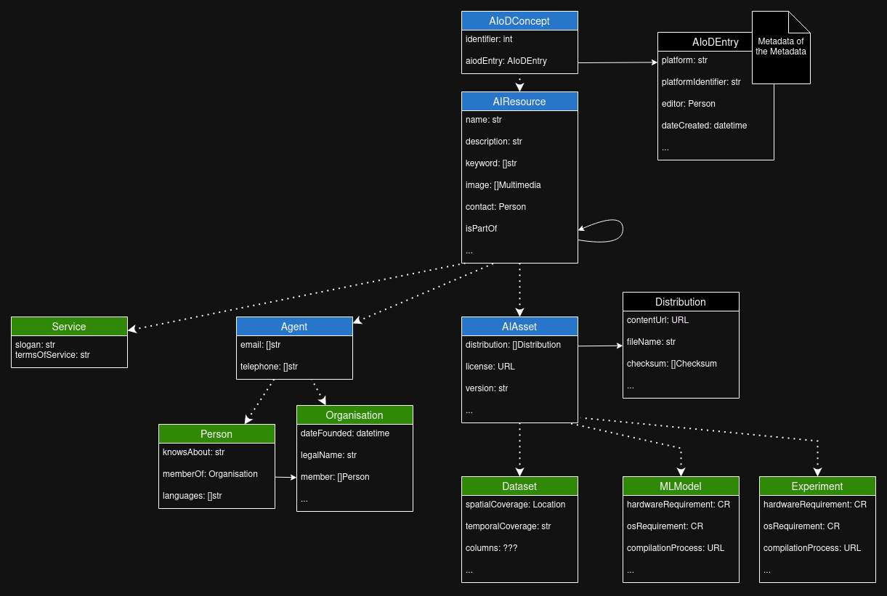

# The AI-on-Demand Metadata Schema
The conceptual AI-on-Demand metadata schema is defined in its own dedicated repository [aiondemand/metadata-schema](https://github.com/aiondemand/metadata-schema).
Questions about the conceptual metadata schema and requests for changes should be directed at that repository instead.

In the REST API, we have an implementation of the schema defined in our [`src/database/model`](https://github.com/aiondemand/AIOD-rest-api/tree/develop/src/database/model) directory.
For the model implementation we make use of [SQLModel](https://sqlmodel.tiangolo.com/), a layer
on top of the ORM framework [SQLAlchemy](https://www.sqlalchemy.org/) and the serialization,
validation and documentation (creating Swagger) framework [pydantic](https://docs.pydantic.dev/),
created by the developer of FASTApi, the framework we use for routing.

SQLModel makes it possible to define only a single model instead of defining the database-layer
(SQLAlchemy) and the logic-layer (Pydantic) separately.
Our implementation relies on inheritance to follow the same class hierarchy as defined in the [metadata schema](https://github.com/aiondemand/metadata-schema),
this makes sure that generic fields, such as name and description, are present and consistent over all resources,
and changes to the conceptual model and the model implementation should be similar.

A partial overview of the metadata model can be found in the
following figure:

## Reading the Conceptual Metadata Schema
Tools and documentation on how to read the conceptual metadata model are currently being written.
This section will be updated at a later date (as of 16-12-2024).

## Reading the Metadata Schema Implementation
This section will be updated at a later date (as of 16-12-2024) and will describe:
 - The use various class variants, such as `XBase`, `XORM`, `XCreate`, with a link to the ["objects"](objects.md) page.
 - A brief discussion on how to read an attribute definition, with a link to the ["attributes"](attributes.md) page.
 - A brief discussion on how to relationships an attribute definition, with a link to the ["relationships"](relationships.md) page.

## Changing the Metadata Schema Implementation
On a high level, changes to the metadata schema implementation consist of three steps: 
 
 * updating the schema implementation in [`src/database/model`](https://github.com/aiondemand/AIOD-rest-api/tree/develop/src/database/model),
 * updating or adding tests which test those changes, and
 * adding a [database migration script]() which updates the database accordingly.

This last step isn't needed during development, where you may recreate a database anytime to model changes.
However, to deploy the changed schema in production we need to be able to change the database,
both its schema and its content, to match the schema defined by the Python classes.
For this reason, a migration script is also _required_ when making changes to the metadata schema implementation.

The subsections in the sidebar document how to execute these steps depending on the type of change you want to make (work in progress):

 - [Attributes](attributes.md) explains how to work with attributes that do not refer to any external tables. For example, adding a field which stores a URL.
 - [Relationships](relationships.md) explains how to work with attributes which define relationships between objects. For example, an asset's creator which is represented with a link to an `Agent`.
 - [Objects](objects.md) explains how work with objects as a whole. For example, adding an entirely new entity to the schema.

